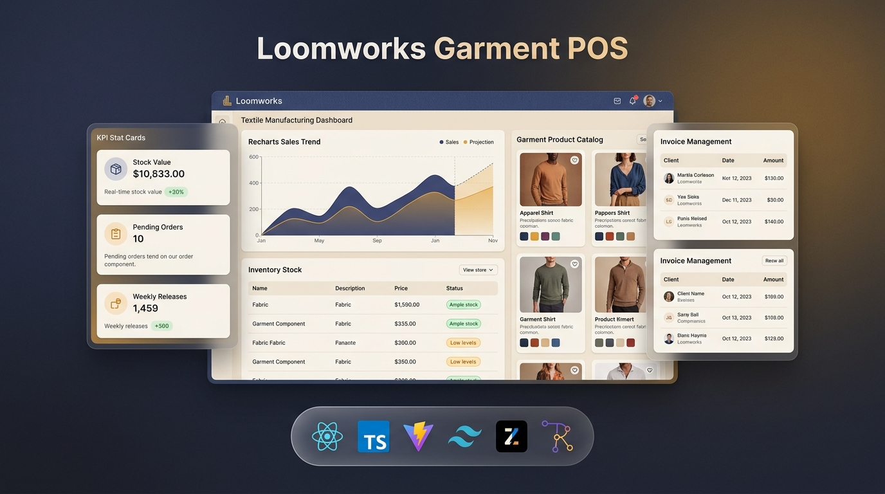

<div align="center">
  
</div>

# Loomworks - Garment POS & Operations Console

A comprehensive frontend operations console and Point-of-Sale (POS) system engineered specifically for garment manufacturing, apparel wholesale, and inventory distribution. Built with a responsive, standalone client-side architecture using in-memory state management.

---

## Overview

Loomworks provides an integrated control center designed to streamline end-to-end apparel operations: from raw fabric intake and floor production releases to wholesale invoicing, vendor lead-time tracking, and multi-store distribution.

### Key Highlights

- **Complete Operational Lifecycle:** Seamless tracking of raw fabrics, trims, work orders, finished inventory, and customer invoices.
- **Textile Workshop Aesthetic:** Curated design language featuring warm paper surfaces, denim-indigo ink accents, ochre thread highlights, and monospace data typography.
- **Zero Backend Required:** Instant deployment and evaluation with reactive Zustand in-memory state stores and pre-seeded realistic industry datasets.
- **Data-Dense Grids & Analytics:** Sortable, searchable, paginated data tables powered by TanStack Table alongside Recharts trend and category distribution visualizations.

---

## Business Workflow

```
[Raw Materials Inward] ───> [Main Stock: Raw]
                                  │
                                  │ Released via Work Orders
                                  ▼
                         [Production Floor]
                                  │
                                  │ Finished Goods Output
                                  ▼
                         [Main Stock: Finished] ───> [Wholesale / Sales Invoicing] ───> [Retail Stores / Customers]

* Operational expenses and supplier payables are tracked across every stage of the pipeline.
```

---

## Technology Stack

| Layer | Technologies |
|---|---|
| **Core Framework** | React 19, TypeScript, Vite 8 |
| **Styling & Design System** | Tailwind CSS v4, PostCSS, Radix UI Primitives, Lucide Icons |
| **Routing** | React Router v7 |
| **State Management** | Zustand (In-Memory Stores with Actions & Computed Selectors) |
| **Data Tables** | TanStack React Table v8 (Sorting, Filtering, Pagination) |
| **Visualizations** | Recharts (Sales Trends, Category Mix, Revenue Curves) |
| **Date & Utilities** | Date-fns, Class Variance Authority (CVA), Clsx, Tailwind Merge |

---

## Application Modules

| Route | Module | Purpose & Capabilities |
|---|---|---|
| `/` | **Dashboard** | Mill overview, high-level KPI cards, sales trajectory charts, stock alerts, active production lines, and recent sales feeds. |
| `/stock` | **Main Stock** | Central inventory for raw materials and finished apparel. Multi-tab classification, real-time stock-status evaluation, and SKU tracking. |
| `/production` | **Production Released** | Work-order management, cutting and assembly progress tracking, target delivery monitoring, and release logs. |
| `/sales` | **Sales & Wholesale** | Wholesale point-of-sale invoice creator with multi-item line builders, dynamic tax/discount calculations, and store assignment. |
| `/expenses` | **Expenses** | Mill operational expense ledger categorized by utilities, machinery maintenance, logistics, and payroll. |
| `/suppliers` | **Suppliers** | Vendor directory detailing material types, lead times, reliability ratings, and outstanding balances. |
| `/customers` | **Customers / Stores** | Wholesale buyer accounts, credit threshold monitoring, order histories, and year-to-date sales figures. |
| `/products` | **Products & Catalog** | Visual line-sheet catalog with color swatch indicators, wholesale price points, cost structures, and availability toggles. |
| `/reports` | **Reports & Analytics** | Financial, inventory, production, and sales analytics with configurable date-range filters and print-ready sheets. |
| `/users` | **User Management** | Internal team directory with role-based access control (Admin, Manager, Cashier, Auditor). |
| `/settings` | **Settings** | Business identity configuration, tax defaults, theme switching (Light / Dark), and notification preferences. |

---

## Design System

The application employs a custom "Textile Workshop" palette structured around warm canvas tones, industrial indigo, and tailored accents:

- **Canvas & Surface:** Warm paper background (`oklch(0.971 0.008 84)`) with high-contrast card elevation.
- **Denim Indigo:** Deep ink tone (`oklch(0.398 0.092 263)`) for navigation bars, active borders, and primary buttons.
- **Ochre Accent:** Thread-gold highlight (`oklch(0.71 0.128 66)`) for progress indicators, warnings, and accents.
- **Typography:**
  - Display: *Bricolage Grotesque*
  - Body & UI: *Inter Tight*
  - Numeric & Data: *IBM Plex Mono*

---

## Project Structure

```
garment-pos-frontend/
├── assets/                  # Documentation assets and banner visuals
├── public/                  # Static assets and icons
├── src/
│   ├── components/
│   │   ├── charts/          # Recharts visualizations (Sales trend, Category mix)
│   │   ├── layout/          # Sidebar, Topbar, App layout shell
│   │   ├── shared/          # Reusable StatCard, PageHeader, StatusBadge, DataGrid
│   │   └── ui/              # Radix UI and customized component primitives
│   ├── data/                # Initial seed datasets (stock, orders, sales, directory)
│   ├── lib/                 # Formatting functions and utilities
│   ├── pages/               # Page views matching application routes
│   ├── store/               # Zustand state stores (stock, sales, production, ui)
│   ├── types/               # TypeScript interface definitions
│   ├── App.tsx              # Application route definitions
│   ├── index.css            # Design tokens, color system, and global Tailwind setup
│   └── main.tsx             # Application mount point
├── package.json             # Project dependencies and build scripts
├── postcss.config.mjs       # Tailwind CSS PostCSS configuration
├── tsconfig.json            # TypeScript configuration
└── vite.config.ts           # Vite bundler configuration
```

---

## Getting Started

### Prerequisites

- Node.js (v18 or higher recommended)
- npm or pnpm

### Installation

```bash
# Clone repository
git clone https://github.com/avishka-hashara/garment-pos-frontend.git

# Navigate to project directory
cd garment-pos-frontend

# Install dependencies
npm install
```

### Development Server

Launch the local development server with hot-module replacement:

```bash
npm run dev
```

Open your browser at `http://localhost:5173`.

### Production Build

Type-check and generate the production-ready bundle:

```bash
npm run build
```

Preview the production build locally:

```bash
npm run preview
```

---

## State & Data Persistence

- All mock data is initialized from `src/data/` and loaded into Zustand stores on application start.
- State changes (adding stock items, creating invoices, releasing work orders) update the in-memory state dynamically throughout the session.
- To reset the application data to default baseline values, refresh the browser page.
